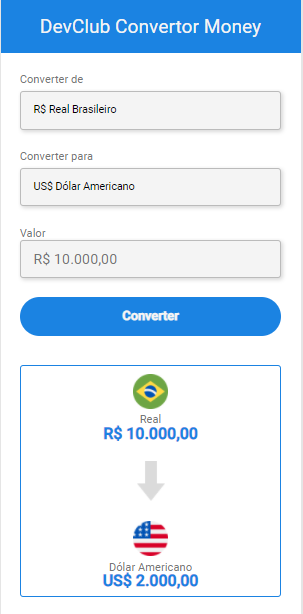

# Projeto conversor de moedas 💸

<!---Esses são exemplos. Veja https://shields.io para outras pessoas ou para personalizar este conjunto de escudos. Você pode querer incluir dependências, status do projeto e informações de licença aqui--->

> Conversor de moedas consumindo API que puxa valores atualizados em tempo real do Dólar e Euro.

### Tecnologias usadas:
 
   
   

## 🤝 Colaboradores

<a href="https://www.linkedin.com/in/marcusviniciusbeghelisantos/" target="_blank">Marcus Vinícius</a>

